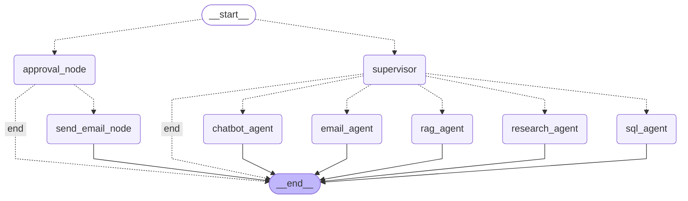

# LangGraph Workflow Architecture

Below is the visual graph structure of the Enterprise Multi-Agent AI Assistant:

```mermaid
---
config:
  flowchart:
    curve: linear
---
graph TD;
	__start__([<p>__start__</p>]):::first
	supervisor(supervisor)
	chatbot_agent(chatbot_agent)
	research_agent(research_agent)
	sql_agent(sql_agent)
	rag_agent(rag_agent)
	email_agent(email_agent)
	approval_node(approval_node)
	send_email_node(send_email_node)
	__end__([<p>__end__</p>]):::last
	__start__ -.-> approval_node;
	__start__ -.-> supervisor;
	approval_node -. &nbsp;end&nbsp; .-> __end__;
	approval_node -.-> send_email_node;
	supervisor -. &nbsp;end&nbsp; .-> __end__;
	supervisor -.-> chatbot_agent;
	supervisor -.-> email_agent;
	supervisor -.-> rag_agent;
	supervisor -.-> research_agent;
	supervisor -.-> sql_agent;
	chatbot_agent --> __end__;
	email_agent --> __end__;
	rag_agent --> __end__;
	research_agent --> __end__;
	send_email_node --> __end__;
	sql_agent --> __end__;
	classDef default fill:#f2f0ff,line-height:1.2
	classDef first fill-opacity:0
	classDef last fill:#bfb6fc

```
